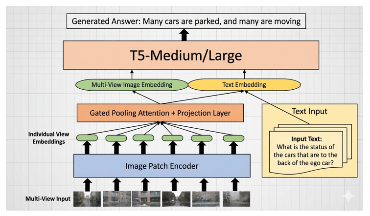
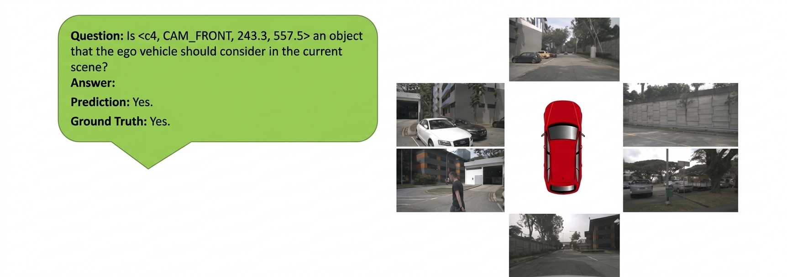
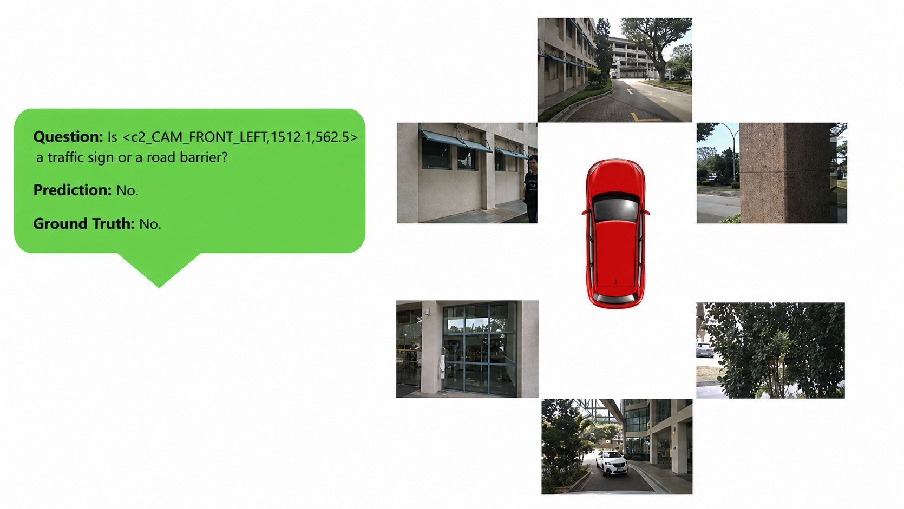
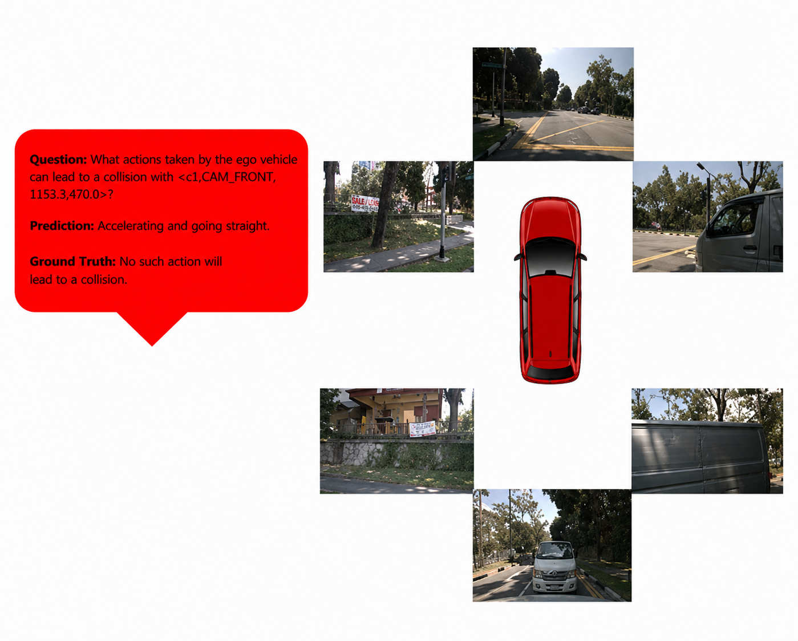

# Multi-Frame, Lightweight & Efficient Vision-Language Models  
### for Question Answering in Autonomous Driving
---

## Overview

This project reviews, reproduces, and extends **EM-VLM4AD** — a lightweight multi-frame Vision-Language Model (VLM) designed for Visual Question Answering (VQA) in Autonomous Driving.

Unlike existing large AD-VLMs (LLaMA-7B, BLIP-2, etc.), EM-VLM4AD is highly efficient and can run on consumer-grade GPUs while processing **six surround-view camera images** at once.

**Key Achievement:**  
Our reproduction matches (and slightly exceeds) the original paper’s performance on the DriveLM benchmark while using **≥10× less memory**.

---

## Key Highlights

- Lightweight architecture (235M – 769M parameters)
- Processes **6 surround-view cameras** simultaneously
- Uses **Gated Pooling Attention** for intelligent multi-view fusion
- Fine-tuned T5 language model for natural language answers
- Much more efficient than DriveLM-Agent, DriveMLM, LLM-Driver, and DriveGPT4
- Proposed novelty: **Temporal Attention Module** for multi-frame reasoning

---

## Model Architecture

**Main Components:**
1. Frozen **ViT-B/32** encoder for each camera view
2. **Gated Pooling Attention** to fuse the six views
3. Projection layer to align with the language model
4. **T5** (Base or Large) for answer generation

---

## Results

### Quantitative Comparison

Our reproduced model outperforms the original paper on BLEU-4, METEOR, ROUGE-L, and CIDEr.

### Correct Predictions

### Failure Cases (mainly Ego-Behavior Prediction)

---

## Proposed Novelty: Temporal Attention Extension

Current models only look at a single timestamp.  
We propose adding a lightweight **Temporal Attention Module** to enable reasoning over multiple frames (important for predicting ego-vehicle behavior and motion).

---

## Computational Efficiency

| Model                  | Parameters | Memory   |
|------------------------|------------|----------|
| EM-VLM4AD Base         | ~320 M     | ~1.2 GB  |
| EM-VLM4AD Q-Large      | 769 M      | **0.77 GB** |
| DriveLM-Agent          | 3.96 B     | 14.43 GB |
| Other large AD-VLMs    | 7–8 B      | 28–36 GB |

---

## Conclusion

This project successfully reproduces EM-VLM4AD and confirms that a carefully designed lightweight multi-frame VLM can achieve strong performance on autonomous driving VQA while remaining practical for real-world deployment.

The main remaining challenge is **temporal reasoning**, which we address by proposing a Temporal Attention Extension.

